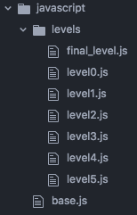

[Play now!](https://keithfrancisb.github.io/Angry-Circles/)

# Angry Circle
Angry Circle is inspired by the game Angry Birds. Angry Birds is a game where you sling birds from one side of the screen with a goal to hit the pigs on the other side. Angry Circles would have same concept just with circles and triangles instead of birds and pigs.

### How to Play
* Click on the circle on the left side of the screen and hold it.
* Drag the circle to the left to increase the tension of the slingshot.
* Release the circle and watch it fly and hit the other objects.
* Knock the triangle down within 4 tries to go to the next level.
* Level will reset if player fails to knock the triangle down within 4 tries.
* Restart button is available if the player wishes to start the game from the first level.

### Technologies and Libraries
* *HTML* : Used to contain the canvas that will run the game.
* *CSS* : Used to format the background, canvas, game instructions, and my contact info.
* *JavaScript* : Used to create the game on the canvas.
* *Matter.js* : Used to handle the necessary physics such as collision impacts, density, weight, friction, and gravity.

### Features
#### Implement physics as accurate as the original game.
  In order to simulate physics as closely as the original Angry Birds game, I decided to use a helper library known as *Matter.js*. *Matter.js* is a 2D rigid body physics engine that does an amazing job handling physical properties of 2D shapes rendered on the screen.

  ```javascript
  const createBox = (x, y, friction) => {
    const box = Bodies.rectangle(x, y, 70, 70, { density: 0.5 });
    box.friction = friction;
    return box;
  };
  ```

  The code snippet above is a great example of one of the many functions that I have implemented in the game that utilizes physical properties, in this case the friction and density of a created box. The function Bodies.rectangle not only simplifies the process of constantly typing out the following code:

  ```javascript
  ctx.beginPath();
  ctx.rect(20, 40, 70, 70);
  ctx.fill();
  ctx.closePath();
  // where ctx is the 2D context of the canvas HTML tag
  ```

  It also creates the rectangle with physical properties that the developer can then utilize at their discretion. Once the these functions have been defined, I use their return value as the shapes to be added to the `World` module of Matter.js. The `World` consists of the shape objects to be rendered on the screen. It is the main object that is to be rendered and interacted with.

#### Organized file strcture for current and future levels.
Given that this is a multi-level type of game where endless mode does not exist, each level must be definite and unique from every other level. That being said, I have decided to create a file structure that would accommodate future levels to be added in the game for easy access and easy implementation.



```javascript
// index.js
import * as level0 from '../assets/javascript/levels/level0';
import * as level1 from '../assets/javascript/levels/level1';
import * as level2 from '../assets/javascript/levels/level2';
import * as level3 from '../assets/javascript/levels/level3';
import * as level4 from '../assets/javascript/levels/level4';
import * as level5 from '../assets/javascript/levels/level5';
import * as finalLevel from '../assets/javascript/levels/final_level';

// LEVEL HANDLER
let gameProgress = 0;
const levels = [level0, level1, level2, level3, level4, level5, finalLevel];
```

  With the power of webpack's file modularization, each level file exports an array of functions that creates a shape object to be rendered for the level and a string of information that pertains to that specific level, which is used to guide or amuse the player.

  ```javascript
  levels[gameProgress].objects.forEach( object => World.add(engine.world, object(engine)) );
  ```

  These level files are then imported into the main file and the objects per level are being added to the `World` using the code above. Once a level has passed, every object in the `World` is removed, the variable gameProgress gets incremented, the objects of the next level are added to the `World` and are then rendered for the player to beat.
